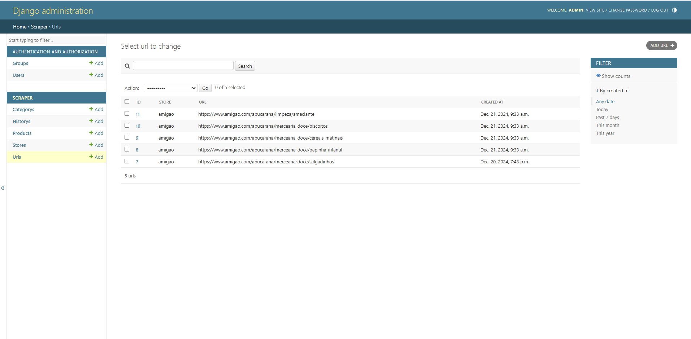
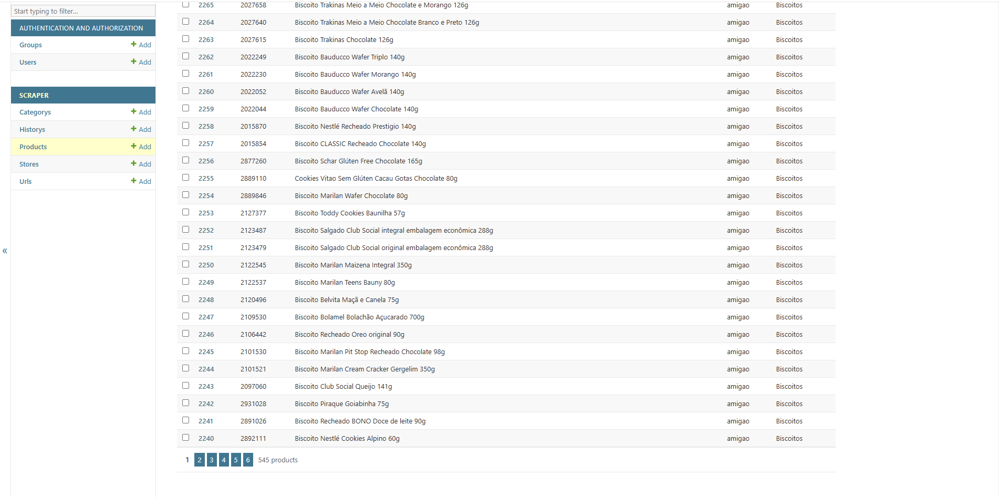
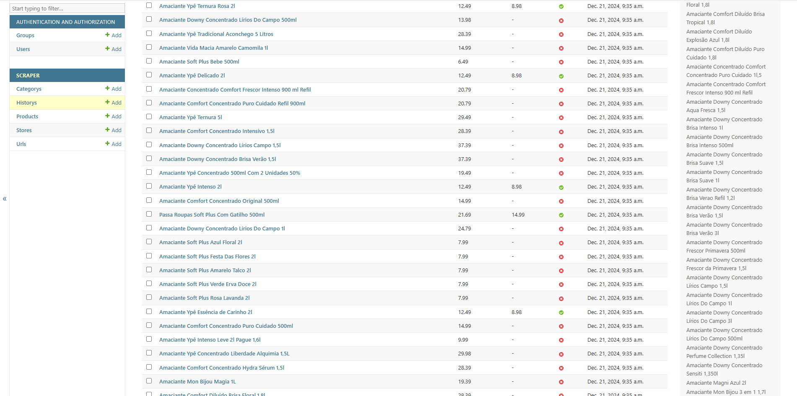
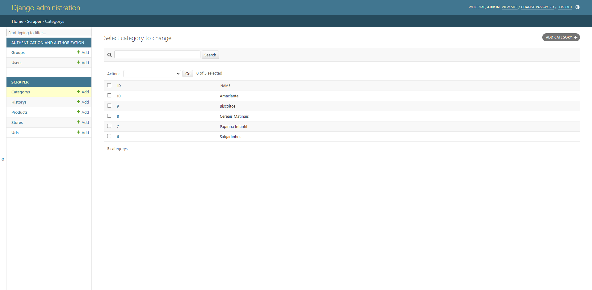

# Teste Técnico: Aplicação Django para Scraping

## Objetivo

Esta aplicação Django foi desenvolvida para coletar e gerenciar informações de produtos do site [Amigão](https://www.amigao.com). O projeto implementa funcionalidades de scraping, administração de dados e registro histórico.

---

## Funcionalidades

1. **Modelagem de Dados**
   - **Store**: Representa lojas.
   - **URL**: URLs para scraping associadas a uma loja.
   - **Product**: Produtos coletados.
   - **History**: Histórico de preços e promoções.

2. **Interface Administrativa Django**
   - **Store**: Operações completas (CRUD).
   - **URL**: Operações completas (CRUD).
   - **Product**: Somente leitura.
   - **History**: Somente leitura com filtros:
     - Descrição do produto.
     - Data.
     - Indicador de oferta (`offer`).

3. **Comando Customizado**
   - `python manage.py getprices`:
     - Realiza scraping de todas as URLs cadastradas.
     - Insere ou atualiza produtos no banco de dados.
     - Registra histórico de preços.
     - Trata promoções e mantém a idempotência.

---

## Tecnologias Utilizadas

- **Linguagem**: Python
- **Framework**: Django
- **Banco de Dados**: SQLite
- **Requisições HTTP**: `requests`
- **Parsing HTML**: `BeautifulSoup`

---

## Configuração

### Pré-requisitos

- Python 3.8+

### Instalação

1. Clone o repositório:

    ```sh
    git clone https://github.com/msotech/amigao-scraper/
    cd amigao_scraper
    ```

2. Crie e ative um ambiente virtual:

    ```sh
    python -m venv venv
    source venv/bin/activate  # No Windows use `venv\Scripts\activate`
    ```

3. Instale as dependências:

    ```sh
    pip install -r requirements.txt
    ```

4. Execute as migrações do banco de dados:

    ```sh
    python manage.py migrate
    ```

5. Crie um superusuário:

    ```sh
    python manage.py createsuperuser
    ```

6. Inicie o servidor de desenvolvimento:

    ```sh
    python manage.py runserver
    ```

## Uso

Com o servidor já iniciado, acesse `http://127.0.0.1:8000/admin` no seu navegador para acessar a interface de administração do Django.

Entre com os dados de superuser criado no passo 5 da `Instalação`.

Adicione uma `Store` e vários `URLs` de produtos do [Amigão](https://www.amigao.com) para serem extraídos futuramente.

Execute o comando `python manage.py getprices` no terminal (garantindo estar na mesma pasta que o arquivo "manage.py") para extrair os dados dos produtos.

## Prints da aplicação





